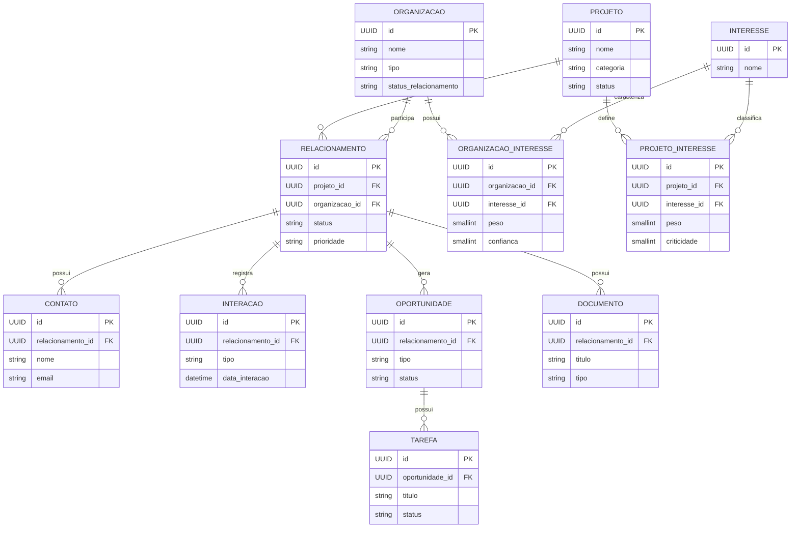

# DER — Atlas

## Versão

0.1.0

## Objetivo

Este documento descreve o Modelo Entidade-Relacionamento (MER/DER) oficial do Atlas.

O objetivo é representar as entidades de domínio, seus atributos principais e os relacionamentos utilizados pelo banco de dados da aplicação.

As migrations Flyway devem sempre refletir este documento.

---

# Diagrama

---

## Agregados

O domínio do Atlas está organizado em quatro agregados principais:

### Projeto

- Projeto
- ProjetoInteresse

### Organização

- Organização
- OrganizaçãoInteresse

### Relacionamento

- Relacionamento
- Contato
- Interação
- Documento
- Oportunidade
- Tarefa

### Inteligência

- Interesse
- Score de Afinidade (futuro)
- Indicadores (futuro)

---

## Observações

Este DER representa a arquitetura lógica do Atlas na versão 0.1.0.

Novas entidades deverão ser incorporadas mediante novas migrations Flyway e atualização deste documento.