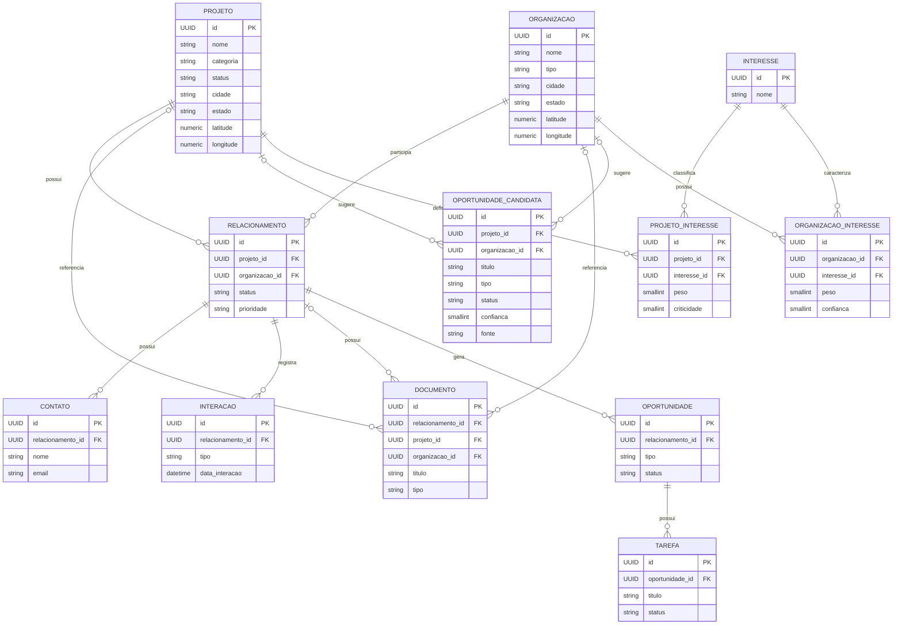

# DER — Atlas

## Versão

0.2.0

## Objetivo

Este documento descreve o Modelo Entidade-Relacionamento (MER/DER) oficial do Atlas.

O objetivo é representar as entidades de domínio, seus atributos principais e os relacionamentos utilizados pelo banco de dados da aplicação.

As migrations Flyway devem sempre refletir este documento.

---

# Diagrama

---

## Observação sobre cardinalidade opcional

`DOCUMENTO` é uma exceção controlada ao agregado de `RELACIONAMENTO` (ver atualização do ADR-005, 2026-06-28): pode existir vinculado a um `RELACIONAMENTO`, **ou** a `PROJETO`/`ORGANIZACAO` diretamente — nunca aos dois ao mesmo tempo. Essa regra é garantida por um `CHECK` no banco e validada também na camada de serviço.

`OPORTUNIDADE_CANDIDATA` nunca depende de `RELACIONAMENTO` — vincula-se opcionalmente a `PROJETO` e/ou `ORGANIZACAO`, e só pode ser promovida a uma `OPORTUNIDADE` real (com `RELACIONAMENTO` próprio) depois que ambos os vínculos existirem e a candidata passar por revisão humana.

---

## Agregados

O domínio do Atlas está organizado em quatro agregados principais:

### Projeto

- Projeto
- ProjetoInteresse

### Organização

- Organização
- OrganizaçãoInteresse

### Relacionamento

- Relacionamento
- Contato
- Interação
- Documento *(exceção controlada — ver observação acima)*
- Oportunidade
- Tarefa

### Inteligência

- Interesse
- OportunidadeCandidata
- Score de Afinidade (view — `vw_score_afinidade`)
- Indicadores (futuro)

---

## Status de implementação

| Entidade | Migration | Implementação Java | Observação |
|---|---|---|---|
| Organizacao | V2, V14, V17 | ✅ Completa | DTO, exceção própria, localização |
| Projeto | V3, V16 | ✅ Completa | |
| Relacionamento | V4 | ✅ Completa | Agregado central (ADR-005) |
| Contato | V5 | ⏳ Apenas banco | Sprint 2 do roadmap |
| Interação | V6 | ⏳ Apenas banco | Sprint 2 do roadmap |
| Oportunidade | V7 | ✅ Completa | |
| Tarefa | V8 | ⏳ Apenas banco | Sprint 2 do roadmap, vinculada a Oportunidade |
| Interesse | V9 | ✅ Completa | |
| OrganizacaoInteresse | V10 | ✅ Completa | Alimenta `vw_score_afinidade` |
| ProjetoInteresse | V11 | ✅ Completa | Alimenta `vw_score_afinidade` |
| vw_score_afinidade | V12 | ✅ Completa | Consultada via `JdbcTemplate`; ver ADR-006 |
| Documento | V13, V15 | ✅ Completa | Exceção ao ADR-005 (ver atualização) |
| OportunidadeCandidata | V18, V19 | ✅ Completa | Staging para sugestões de IA; sem ADR formal próprio ainda |
| Inteligência (domínio) | — sem tabela própria | ✅ Completa (modo on-demand) | Lê Projeto, Organizacao e a view; decisão on-demand vs. batch ainda não registrada em ADR |

---

## Histórico de revisões

| Versão | Data | Mudanças |
|---|---|---|
| 0.1.0 | 2026-06-27 | Versão inicial do DER |
| 0.2.0 | 2026-06-28 | Remoção de `status_relacionamento` de Organização (V14); adição de localização em Projeto (V16) e Organização (V17); Documento ganha FKs opcionais para Projeto/Organização (V15); criação de OportunidadeCandidata (V18, V19); adicionada seção de status de implementação |

---

## Observações

Este DER representa a arquitetura lógica do Atlas na versão 0.2.0.

Novas entidades deverão ser incorporadas mediante novas migrations Flyway e atualização deste documento — conforme determina a diretriz do ADR-001.